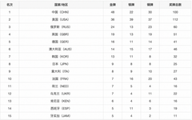
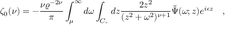
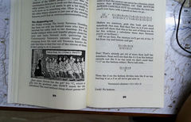
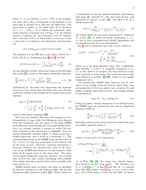

# KLiteInfer

> 从零实现的 C++ / CUDA 大模型推理引擎，支持纯文本 LLM 与视觉-语言多模态推理

CPU / CUDA 双后端，约 1.9 万行 C++/CUDA。已跑通
**Llama2**、**Qwen3-0.6B**、**PaddleOCR-VL0.9B**。

- **多模态全流程自研**：SigLIP ViT（27 层 + 2D RoPE + 双向注意力）→ Projector（2×2 spatial merge）→ ERNIE4.5 解码器（GQA + 3D-MRoPE）
- **与 HuggingFace 逐字对齐**：官方测试图 7/7 OCR 结果完全一致，中间张量 8 个阶段余弦相似度均为 `1.00000000`
- **端到端快 10.9×**：同精度同解码条件下对比 HF Transformers
- **44 个单测**：每个 CUDA kernel 都有 CPU 对照实现与一致性测试

---

## OCR 效果

PaddleOCR 官方测试图，与 HF 参考实现在对等条件下（同一份输入、fp32、贪心解码）逐字比对：

| 输入图片 | 类型 | KLite 识别结果 | 与 HF | 耗时 |
| :--: | :--: | --- | :--: | --: |
|  | 中文表格<br><sub>960 patches</sub> | 名次 \| 国家/地区 \| 金牌 \| 银牌 \| 铜牌 \| 奖牌总数<br>1 \| 中国 (CHN) \| 48 \| 22 \| 30 \| 100<br>… | ✅ | **0.9 s**<br><sub>HF 7.1 s</sub> |
|  | 数学公式<br><sub>888 patches</sub> | `\[\zeta_{0}(\nu)=-\frac{\nu\varrho^{-2\nu}}{\pi}\int_{\mu}^{\infty}…` | ✅ | **0.7 s**<br><sub>HF 3.8 s</sub> |
|  | 英文书页<br><sub>3900 patches</sub> | The disappearing sum<br>It's Friday evening. The lovely Veronica Gumfl… | ✅ | **3.8 s**<br><sub>HF 42.8 s</sub> |
|  | 学术文档<br><sub>4408 patches</sub> | where t E = σ r c / 4 π G m p = 4.5 × 10 8 yr is the Eddington time… | ✅ | **4.5 s**<br><sub>HF 53.0 s</sub> |
|  | 中文文本行<br><sub>780 patches</sub> | 绿洲仕格维花园公寓 | ✅ | **0.5 s**<br><sub>HF 0.4 s</sub> |

7 张图**全部逐字一致**，字符错误率 **0.0000%**（编辑距离 0 / 1530 字符）。

---

## 精度与性能

**精度**：以 HF 实现 dump 的中间张量为 ground truth，从 patch embedding 到视觉特征注入共
8 个阶段逐一比对，余弦相似度全部为 `1.00000000`，最大相对误差 `9.1e-5`（27 层 fp32 累积）。
CPU 与 CUDA 两条实现独立通过同一套比对，贪心解码下输出逐字节相同。

**性能**：NVIDIA H20，fp32 全精度 · 贪心解码 · batch = 1 · 无量化，3 次取中位数。

| PaddleOCR-VL 0.9B<br><sub>book.jpg, 3900 patches, 生成 128 tokens</sub> | 视觉编码 | 端到端 | 图像吞吐 |
| --- | --: | --: | --: |
| **KLiteInfer** | **0.41 s** | **3.91 s** | **15 img/min** |
| HF Transformers 4.55 | — | 42.49 s | 1.4 img/min |

视觉 encoder 是 27 层 × 3900 token 的批量 GEMM（约 3.5 TFLOP），占推理算力九成以上，
全部自写 CUDA kernel，是加速的主要来源。

---

## 架构

<p align="center">
  
</p>

自底向上五层：`base`（Buffer + CPU/CUDA 分配器，CUDA 侧带内存池）→ `tensor`（多维张量、
设备迁移）→ `kernels/{cpu,cuda}`（22 个 kernel 文件，运行时按 `DeviceType` 分发）→
`op`（`Layer` 算子抽象）→ `model`（权重 mmap 零拷贝、KV-Cache、prefill / decode）。

**通用算子**（CPU / CUDA 双实现）：Add、MatMul（含 int8 quant）、RMSNorm、RoPE、MRoPE、
MHA、SwiGLU、Embedding、Softmax、Scale、Argmax。

**视觉算子**（批量 token、行主序）：GEMM+bias 走 cuBLAS（行↔列主序映射，需显式关闭 TF32
才能保住精度）、双向注意力用 `SgemmStridedBatched` ×2 + softmax、LayerNorm 为
block-per-row 两趟归约，另有 2D RoPE、bilinear 位置编码插值、2×2 spatial merge。

---

## 快速开始

```bash
# 依赖：CUDA Toolkit、glog、GTest、Armadillo、sentencepiece、abseil / re2 / nlohmann_json
cmake -S . -B build && make -C build -j$(nproc)

# 权重转换（Qwen3 / PaddleOCR-VL 从 HF safetensors 转成 KLite 扁平格式；
# stories110M.bin 是 llama2.c 原始格式，无需转换）
python3 tools/export_qwen3.py        <hf_dir> <out.bin> --seq-len 2048
python3 tools/export_paddleocr_vl.py <hf_dir> <out.bin> --seq-len 4096

# 运行（路径参数可省略，默认取 src/config/config.cpp）
./build/demo llama
./build/demo qwen3 "" "" "用一句话解释什么是张量"
./build/demo paddleocr
```

### 常驻服务

`demo` 每次都要重新加载权重。要反复调用就起服务，模型只加载一次常驻在显存里：

```bash
# 服务端：加载模型并常驻（qwen3 约 1.3 s 加载完成）
./build/klite_server --model qwen3 --port 8080
./build/klite_server --model paddleocr --port 8081     # 多模态

# 客户端：流式输出，边生成边打印
./build/klite_client --stream "什么是 KV-Cache？"
./build/klite_client --port 8081 --ocr <ref_dir>            # OCR
./build/klite_client --health
```

也可以直接用 curl：

```bash
curl -s localhost:8080/generate -d '{"prompt":"你好","max_tokens":128}'
# {"text":"...","prompt_tokens":14,"generated":83,"ttft_ms":32.6,"decode_tps":376.7,...}
```

| 接口 | 说明 |
| --- | --- |
| `GET /health` | 模型名、设备、加载耗时 |
| `POST /generate` | `{"prompt", "max_tokens", "stream"}` → 文本 + 分段耗时 |
| `POST /ocr` | `{"ref_dir", "max_tokens", "stream"}` → 识别结果 |

`stream: true` 走 HTTP chunked 逐段返回。服务端**单线程串行**处理请求 —— KV-Cache 由单个
请求独占，并发进来会互相覆盖；要提升并发需要 continuous batching（见下）。
服务端与 `demo` 共用 `serve::generate_*` 同一套生成逻辑，客户端只依赖标准 socket。

---

## 测试

```bash
bash tools/run_demos.sh                    # 一键回归：3 个 demo + 数值校验 + 44 个单测
python3 tools/compare_paddleocr.py <dir>   # 逐阶段数值比对，定位首个发散点
python3 tools/ocr_eval.py <hf_dir> <image_dir> <out_dir>   # 多图 OCR 对比，算 CER
python3 tools/benchmark_vs.py ocr <hf_dir> <image> --ref-dir <dir>   # 与 HF 同条件测速
```

---

## 已知限制与后续

prefill 逐 token 串行未做批量 GEMM；无 CUDA Graph / 算子融合 / paged attention；
仅 fp32（int8 量化只在文本 MatMul 上实现）；图像预处理仍依赖 Python 产出的预处理结果。

后续：批量 prefill → CUDA Graph 与算子融合 → C++ 图像预处理 → FP16 / INT8 → continuous batching。

---

## 致谢

[KuiperLLama](https://github.com/zjhellofss/KuiperLLama)（最初的参考与启发）、
[PaddleOCR-VL](https://huggingface.co/PaddlePaddle/PaddleOCR-VL)（多模态目标模型与参考实现）。
本项目仅供学习与研究使用。
