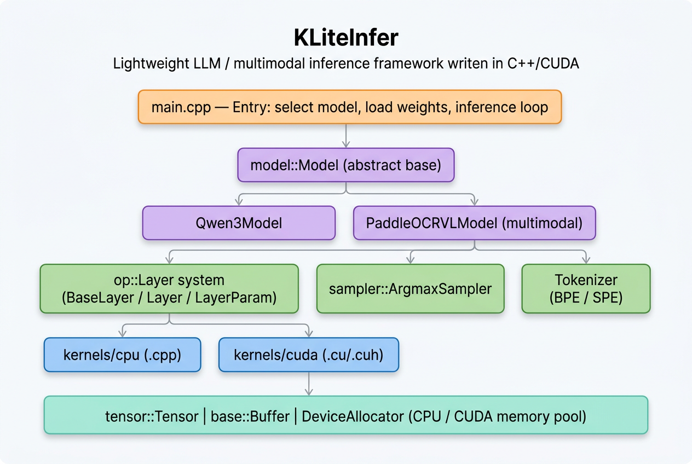

# KLiteInfer

> 一个轻量级、易于扩展的 LLM / 多模态大模型推理框架（C++ / CUDA）

KLiteInfer 是一个从零开始构建的简易推理框架，在参考 [KuiperLLama](https://github.com/zjhellofss/KuiperLLama) 的基础上，逐步扩展为支持 **多模态推理** 的引擎，目标是适配 **百度 PaddleOCR-VL** 等视觉-语言模型。

---

## ✨ 特性

- 🚀 **纯 C++ / CUDA 实现**：无 Python 运行时依赖，性能可控
- 🧠 **多模型支持**：内置 `Qwen3`、`Llama`、`Qwen` 等模型加载入口，可扩展
- 🖼️ **多模态扩展**：支持 PaddleOCR-VL（SigLIP Vision Encoder + Projector + ERNIE/Qwen 文本解码器 + 3D-MRoPE）
- ⚡ **CPU / CUDA 双后端**：算子提供 CPU 与 CUDA 两套实现，运行时按设备切换
- 🔧 **算子化设计**：将模型解耦为 `Layer` 单元，便于复用与单元测试
- 📦 **统一内存抽象**：通过 `DeviceAllocator` 屏蔽 CPU / CUDA 内存管理差异，并对 CUDA 内存做了简单池化
- 🪶 **量化模型支持**：内建 `LayerParam` 对量化权重 (`scales` + `group_size`) 的支持
- 📜 **glog 日志**：统一的日志体系，便于调试
- ✅ **GTest 单元测试**：覆盖 base / tensor / op 三层

---

## 📁 项目结构

```
KLiteInfer/
├── include/                       # 对外头文件
│   ├── base/                      # 基础设施（Status/DataType/Allocator/Tokenizer/Buffer 等）
│   ├── config/                    # 模型路径与推理参数
│   ├── model/                     # 模型抽象与具体模型
│   │   ├── model.h                #   - Model 抽象基类
│   │   ├── qwen3.h                #   - Qwen3 模型
│   │   └── paddleocr.h            #   - PaddleOCR-VL 多模态模型
│   ├── op/                        # 算子层
│   │   ├── layer.h                #   - BaseLayer / Layer / LayerParam
│   │   ├── add.h / matmul.h / rmsnorm.h
│   │   ├── rope.h / mha.h / swiglu.h
│   │   ├── embedding.h / encode.h
│   ├── sampler/                   # 采样器（argmax 等）
│   └── tensor/                    # Tensor 抽象
├── src/                           # 实现
│   ├── base/                      # CPU/GPU allocator、buffer、unicode
│   ├── config/                    # 路径与参数实例
│   ├── model/                     # qwen3.cpp / paddleocr.cpp / model.cpp
│   ├── op/
│   │   ├── kernels/
│   │   │   ├── cpu/               # CPU kernels (.cpp)
│   │   │   └── cuda/              # CUDA kernels (.cu/.cuh)
│   │   ├── add.cpp / matmul.cpp / RMSNorm.cpp ...
│   ├── sampler/                   # argmax_sampler
│   └── tensor/                    # tensor.cpp
├── test/                          # GTest 单元测试
│   ├── base_test/                 # 内存分配器测试
│   ├── tensor_test/               # tensor / buffer 测试
│   └── op_test/                   # CUDA 算子单测
├── main.cpp                       # 推理入口示例
└── README.md
```

---

## 🧩 架构概览

<p align="center">
  
</p>

> 自顶向下：`main.cpp` 入口 → `model::Model` 抽象（Qwen3 / PaddleOCR-VL）→ `op` / `sampler` / `tokenizer` 三大子系统 → `kernels/cpu` 与 `kernels/cuda` 双后端 → 底座 `tensor::Tensor` / `base::Buffer` / `DeviceAllocator`。

### 核心模块说明

| 模块 | 主要类 / 文件 | 职责 |
| --- | --- | --- |
| **base** | `Status`, `DeviceAllocator`, `CPUDeviceAllocator`, `CUDADeviceAllocator`, `Buffer`, `TokenizerType` | 错误码、内存管理（含 CUDA 内存池）、底层缓冲区 |
| **tensor** | `tensor::Tensor` | 多维张量，支持 CPU/CUDA 切换、reshape、stride、clone |
| **op** | `BaseLayer` / `Layer` / `LayerParam` | 算子统一抽象（init / forward / set_weight / check） |
| **kernels** | `add / matmul / rmsnorm / rope / mha / swiglu / emb / softmax / argmax` | 双后端算子实现 |
| **sampler** | `ArgmaxSampler` | 解码采样策略 |
| **model** | `Model`, `Qwen3Model`, `PaddleOCRVLModel` | 模型组装、KV-Cache、forward / predict |

### 已实现算子

| 算子 | CPU | CUDA |
| --- | :---: | :---: |
| Add (residual) | ✅ | ✅ |
| MatMul (含 quant) | ✅ | ✅ |
| RMSNorm | ✅ | ✅ |
| RoPE | ✅ | ✅ |
| MHA (Multi-Head Attention) | ✅ | ✅ |
| SwiGLU | ✅ | ✅ |
| Embedding | ✅ | ✅ |
| Softmax | ✅ | — |
| Scale / ScaleSum | ✅ | — |
| Argmax | — | ✅ |

---

## 🤖 已支持模型

### 1. Qwen3（主要支持）

通过 `model::Qwen3Model` 加载，支持 BPE tokenizer，使用 KV-Cache + RoPE + GQA + SwiGLU 标准 LLaMA 风格 Transformer。

### 2. Llama / Qwen（接口预留）

在 `config/config.h` 中预留了路径配置入口，模型主体可基于 `Qwen3Model` 扩展。

### 3. PaddleOCR-VL（多模态）

通过 `model::PaddleOCRVLModel` 提供端到端多模态推理：

- **Vision Encoder**：SigLIP-like ViT（27 层、hidden=1152、patch=14、2×2 spatial merge）
- **Projector**：`linear_1 + GELU + linear_2`，将视觉特征映射到文本隐层
- **Text Decoder**：ERNIE 4.5 / Qwen 类（hidden=896、24 层、14 头）
- **3D-MRoPE**：`(t, h, w)` 三维位置编码，统一文本/图像 token 位置
- **多模态特殊 token**：`image_token_id=100017`、`vision_start_token_id=100016`

核心扩展接口：

```cpp
// 多模态预测入口
base::Status predict_multimodal(const std::vector<int>& tokens,
                                const std::vector<ProcessedImage>& images,
                                bool is_prompt,
                                int& next_token) const;

// 图像编码
tensor::Tensor encode_image(const tensor::Tensor& pixel_values,
                            const ImageGridTHW& grid_thw) const;

// 3D-MRoPE 位置计算
MRoPEPositions compute_mrope_positions(const std::vector<int>& tokens,
                                       const std::vector<ProcessedImage>& images) const;
```

#### 推理流程

```
pixel_values [T, C, H_pix, W_pix]
        │
        ▼  _unfold_pixels (Conv2d 等价展开)
[num_patches, C·p·p]
        │
        ▼  PatchEmbedLayer
[num_patches, hidden]
        │
        ▼  N × { LN → fused QKV → RoPE → Self-Attn → out_proj → +residual
                LN → fc1 → GELU → fc2 → +residual }
        │
        ▼  post_layernorm
        │
        ▼  _spatial_merge  (2×2)
[num_img_tok, hidden·4]
        │
        ▼  linear_1 → GELU → linear_2
[num_img_tok, text_hidden]
        │
        ▼  按 image_token_id 占位符行将视觉特征注入 input_embeddings
        │   (device-aware memcpy，支持 CPU↔CUDA)
        │
        ▼  Text LLM (Qwen3 风格 transformer + KV-Cache + MRoPE)
        │
        ▼  ArgmaxSampler → next_token
```

#### 推理流程已修复的 Bug（2026-06）

经过一次系统性 review，下列在初版多模态流水线中存在的问题已被修复：

| # | 位置 | Bug | 修复 |
| --- | --- | --- | --- |
| 1 | `_encoder_layer` | fused QKV 输出 layout 实际为 `[T, 3·hidden]` 行内拼接，旧版按 `[3, T, hidden]` 切片 → Q/K/V 全部错位 | 重写为按行 `qkv_data + i·3·hidden + {0,1,2}·hidden` 取 Q/K/V |
| 2 | `_encoder_layer` | RoPE 入参声明但被注释掉，从未生效 | 在每层对 Q/K 应用成对旋转（基于 `_build_vision_rope` 的 cos/sin） |
| 3 | `_encoder_layer` | 借用了 `projector_layers_->act` 做 GELU，与后续 `_project` 共享同一 layer 实例的 IO 状态 | 改为内联近似 GELU 计算，移除耦合 |
| 4 | `encode_image` | 直接把 `[T, C, H_pix, W_pix]` 喂入 `PatchEmbedLayer`（其要求已 unfold 的 `[N, C·p·p]`） | 新增 `_unfold_pixels`，等价于 `Conv2d(kernel=p, stride=p)` 展开 |
| 5 | `_spatial_merge` / `_project` | 强制 CPU allocator 生成输出，但来源 hidden 若在 CUDA → `std::memcpy` 直接段错误 | 视觉算子统一在 CPU 上构建（含权重），整路 CPU；中间张量都用 CPU allocator |
| 6 | `embedding_multimodal` | `std::memcpy` 拷贝到 `input_embeddings`，CUDA 模式下非法访问 | 改用 `Buffer::allocator()->memcpy(..., kMemcpyCPU2CUDA)`，并在结束处 `cudaStreamSynchronize` |
| 7 | `predict_multimodal` | 把 `[3, L]` 的 mrope 张量当 1D `pos_tensor` 传给基类 `fill_input`（语义错） | 跳过 `fill_input`；显式从 `kInputPos` buffer 取 1D pos |
| 8 | `predict_multimodal` | decode 阶段不递增 KV-cache 索引，会重复写第 0 个槽位 | 引入 `mutable mm_decode_step_`：prompt 时重置为 token 数，decode 时步进 |
| 9 | `init_mem` | 用 `vl_config_->text_hidden_size_` 创建 LLM 输入 embedding，可能与权重的 `config_->dim_` 不一致 | 优先取 `config_->dim_`，缺省再 fallback 默认值 |
| 10 | `init_mem` | 创建了 `kMRoPEPositions` buffer 但 `compute_mrope_positions` 每次重分配 | 改为复用 buffer + 容量不足时再 fallback |
| 11 | `forward` | 是空 stub 却照常返回 `Success`，下游 `post_processing` 会读到未初始化的 `forward_output` 当 logits | 校验 LLM 权重是否挂载，未就绪时返回 `NotImplemented`；`post_processing` 在 LLM 未就绪时返回 `-1` |
| 12 | `compute_mrope_positions` | 当 token 序列中 image 占位不足一个 span 时，`img_idx` 仍误推进 | 仅在整个 span 都被消费时才 `++img_idx` |
| 13 | `main.cpp` | `image_token_id` 写死 `100017`，与 `vl_config_` 默认值脱钩；`grid_thw` 中把 patch 单位的 H/W 又乘以 1 注释为 patch unit，含义混乱 | 从 `PaddleOCRVLTransformerConfig` 默认值取 token id；`grid_thw` 直接以 patch 单位传入，并显式插入 `vision_start_token_id` |
| 14 | `embedding` | 当 `embedding_layer_` 未挂载时直接 `LOG(FATAL)` | 改为 WARN + `memset_zero`，让上层能拿到清晰错误而不是崩溃 |

---

## 🛠️ 依赖

| 依赖 | 用途 |
| --- | --- |
| **CUDA Toolkit** | GPU 算子（如启用 `use_cuda`） |
| **glog** | 日志 |
| **GTest** | 单元测试 |
| **Armadillo** | 张量数学辅助 |
| **sentencepiece** | SPE tokenizer（Llama） |
| **abseil / re2 / nlohmann_json** | BPE tokenizer（Qwen / Qwen3）依赖 |

---

## 🚀 构建与运行

### 构建

```bash
git clone https://github.com/<your_name>/KLiteInfer.git
cd KLiteInfer

mkdir build && cd build
cmake ..
make -j$(nproc)
```

### 配置模型路径

编辑 `src/config/config.cpp`，修改下列路径为你本地的模型权重位置：

```cpp
const std::string qwen3_model_path     = "./qwen3-0.6b/model.safetensors";
const std::string qwen3_tokenizer_path = "./qwen3-0.6b/tokenizer.json";
// ...
const int  max_generate_steps = 2048;
const bool use_cuda           = true;   // 切换 CPU / CUDA
```

### 运行示例（main.cpp）

```bash
./demo qwen3                  # 运行 Qwen3
./demo llama                  # 运行 Llama
./demo qwen                   # 运行 Qwen
./demo paddleocr [image.bin]  # 运行 PaddleOCR-VL（image.bin 为已 normalize 的 fp32 像素）
```

输出示例：

```
I0601 14:53:00 main.cpp:86] Using model: Qwen3
AI is the simulation of human intelligence by machines ...
----------------------------------------
Generate steps: 128
Duration: 1.42 s
Speed: 90.14 steps/s
----------------------------------------
```

### 推理流程（`main.cpp`）

```cpp
model::Qwen3Model model(base::TokenizerType::kEncodeBpe,
                        tokenizer_path, checkpoint_path, /*is_quant*/ false);
model.init(base::DeviceType::kDeviceCUDA);

auto tokens = model.encode(prompt);
const auto& embedding = model.embedding(tokens);

while (pos < total_steps) {
    pos_tensor.index<int32_t>(0) = pos;
    auto input = model.fill_input(pos_tensor, embedding, is_prompt);
    model.predict(input, pos_tensor, is_prompt, next);
    if (model.is_sentence_ending(next)) break;
    ++pos;
}
```

---

## 🧪 单元测试

```bash
cd build
ctest --output-on-failure
# 或直接运行
./test/test_llm
```

测试覆盖：

- `base_test/test_alloc.cpp` — CPU / CUDA 内存分配器
- `tensor_test/test_buffer.cpp`、`test_tenosr.cpp` — Tensor 与 Buffer
- `op_test/test_cuda_*.cpp` — CUDA 算子（add / emb / matmul / rmsnorm / rope / softmax / swiglu / scale）

---

## 🗺️ Roadmap

- [x] 基础 Tensor / Allocator / Layer 抽象
- [x] CPU + CUDA 双后端算子
- [x] Qwen3 全流程推理（KV-Cache + RoPE + GQA + SwiGLU）
- [x] PaddleOCR-VL 多模态接口（SigLIP + Projector + 3D-MRoPE）落地（CPU 主路径）
- [x] PaddleOCR-VL 推理流程 bug 修复（QKV 切片 / RoPE / unfold / device-aware memcpy / KV 位置 / mrope buffer 等 14 项）
- [ ] PaddleOCR-VL 权重加载（gen_model_from_file 适配 SigLIP + Projector）
- [ ] PaddleOCR-VL LLM forward 与 Qwen3 transformer block 工具化复用
- [ ] PaddleOCR-VL 端到端跑通与精度对齐
- [ ] PaddleOCR-VL 视觉算子 CUDA kernel（LayerNorm / GELU / PatchEmbed / VisionAttn）
- [ ] 更多采样策略（top-k / top-p / temperature）
- [ ] FP16 / INT8 / INT4 量化推理完善
- [ ] Continuous Batching / PagedAttention

---

## 📚 致谢

- [KuiperLLama](https://github.com/zjhellofss/KuiperLLama) — 项目的最初参考与启发
- [PaddleOCR-VL](https://github.com/PaddlePaddle/PaddleOCR) — 多模态目标模型

---

## 📄 License

本项目仅供学习与研究使用。
